# Using "Embed an OMERO slide" - a visual guide for teachers

This is for anyone with editing rights in a course who wants to embed an
OMERO microscopy slide into a Label, Page, or Book chapter, with your own
commentary alongside it - no HTML or URLs to type by hand. It assumes
someone else has already configured the OMERO server itself (see
[README.md](README.md) if that's you instead) - but **your own subject
account is something you add yourself**, no admin or manager needed (see
Step 1 below).

The same guide, with the same steps, is also available inside Moodle
itself - look for **"New to this? Read the visual guide"** next to the
"Embed an OMERO slide" tool. This file exists alongside it so the guide is
still readable if you're browsing the repository, or if your institution's
network blocks GitHub images at the point you'd actually want them.

## Step 0: Finding the tool

Go into your course. Look at the row of tabs near the top (Course,
Participants, Grades...) and click **"More"** - a dropdown opens. Click
**"Embed an OMERO slide"**.

If you don't see it there, you don't have editing rights in this
particular course, or it hasn't been enabled yet - ask whoever manages
your Moodle's plugins.

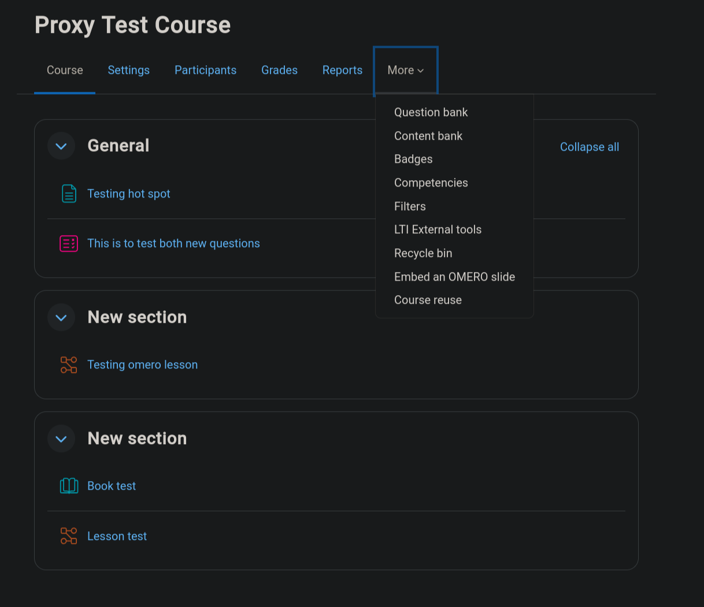

## Step 1: Load a slide

- **Subject account** - a dropdown. Pick whichever matches the department
  or subject area your slide belongs to. Don't see one yet? Click
  **"Manage your OMERO connections"** next to the dropdown (or go directly
  to `local/omeroembed/mysubjects.php?courseid=<id>`) to add your own
  OMERO service-account credentials - entirely self-service, nobody needs
  to set this up for you.
- **Image ID** - the OMERO image ID of the slide you want. You'll already
  know this from having uploaded/found the image in OMERO yourself.
- **Dataset ID (optional)** - only if you want students to be able to
  browse between other images in the same dataset (see "Let students
  browse..." below). Leave blank for a single standalone slide.
- **Let students browse other images in this dataset** - only relevant if
  you gave a Dataset ID. If checked, students see a thumbnail strip they
  can click through. If unchecked, they only ever see the one image.

Then click **Load slide**. You'll see the real, live slide viewer appear -
pan and zoom it exactly like you would in OMERO itself, since it *is*
OMERO, just shown through this page.

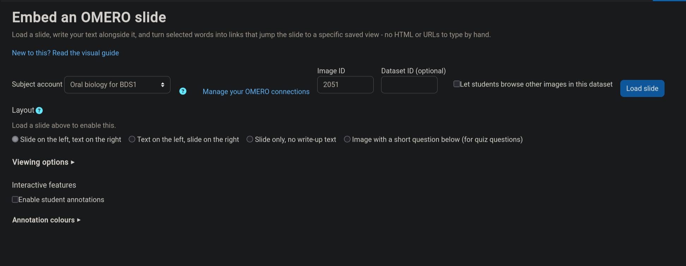

## Step 2: Choose a layout

Three real choices:

- Slide on the left, text on the right
- Text on the left, slide on the right
- Slide only, no write-up text at all

Switching between them later is completely safe - nothing you've already
written is ever lost, no matter how many times you switch back and forth.

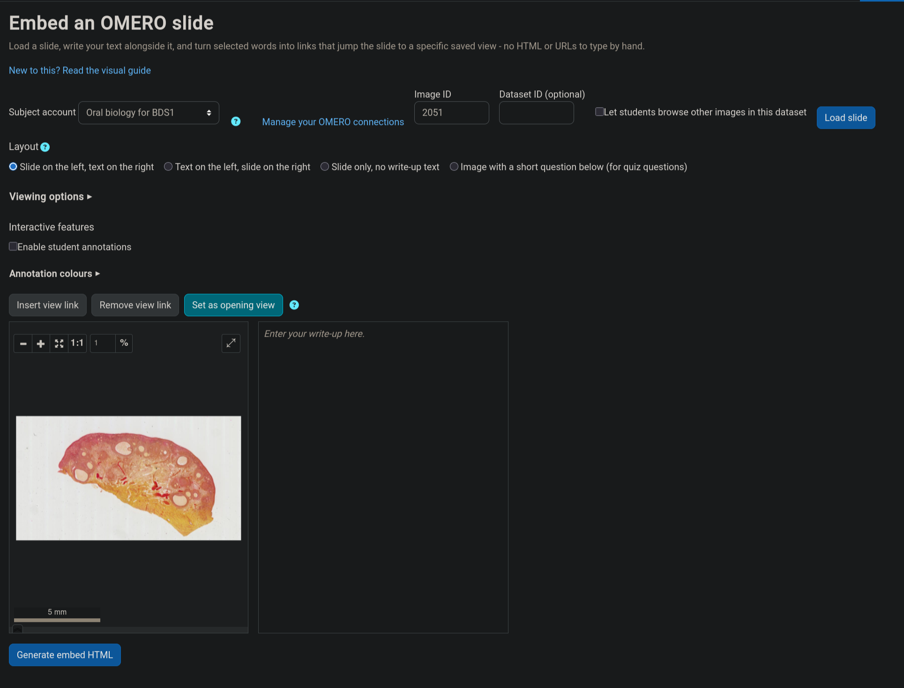

## Step 3: Write your text and add view-links

(Skipped if you chose "Slide only".)

If you're used to preparing teaching material with a slide on one side and
your commentary on the other, with certain words linking to a specific
part of the slide, this is that same pattern.

1. Type your write-up in the text box next to the slide, as normal.
2. Pan and zoom the slide to a spot worth pointing out.
3. **Select the relevant word or phrase** in your text (e.g. select the
   word "enamel" in a sentence about enamel).
4. Click **Insert view link**. That text becomes a clickable link - later,
   when a student clicks it, the slide jumps to exactly the view you had
   set up.
5. Repeat for as many different views as you like, even on the same
   image.

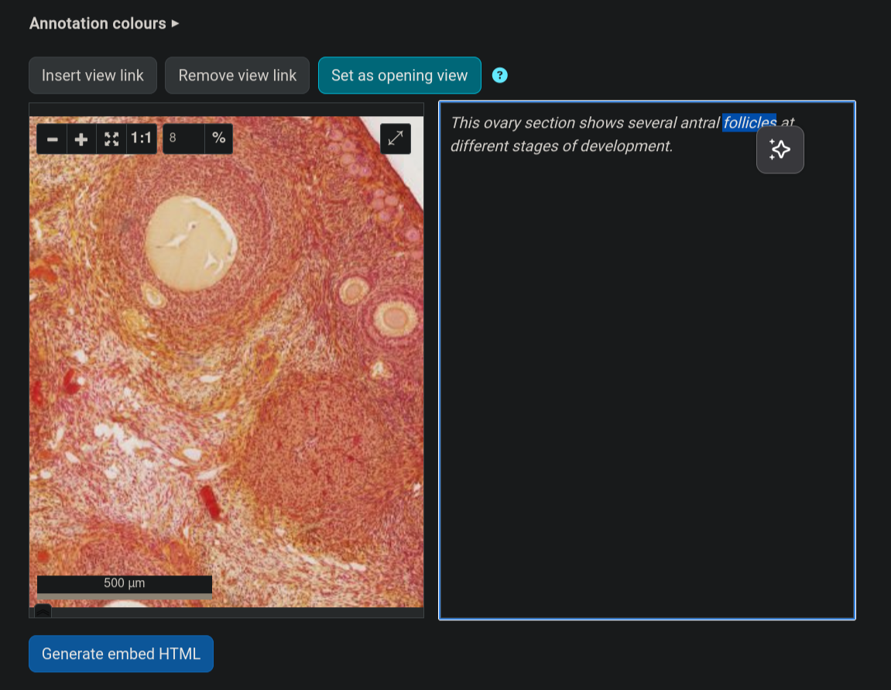

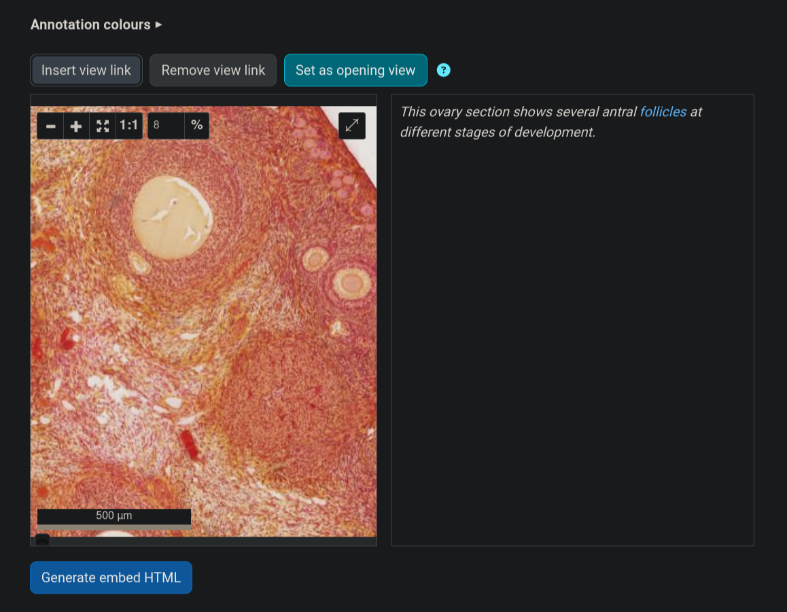

## Step 4: Set the opening view (optional)

This is a separate thing from a view-link. A view-link is "clicking this
word jumps the slide to here." The **opening view** is "when this embed
first loads on the page, before anyone clicks anything, this is what it
shows."

To set it: pan/zoom the slide to the position you want it to open on, then
click **Set as opening view**. Unlike a view-link, this doesn't insert
anything into your text - it just quietly remembers that position for
when you generate the final embed.

If you skip this step, the embed just opens showing the whole slide at
its default zoom.

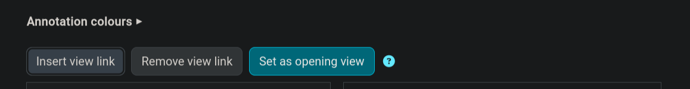

## Step 5: Generate and paste

1. Click **Generate embed HTML**.
2. Click **Copy to clipboard**.
3. Go to wherever you want the slide to appear - a Label, a Page, a Book
   chapter, anything with Moodle's normal text editor - and paste.
4. Save.

That's it. Students see the slide and your write-up exactly as you built
them. Clicking one of your view-links reloads *only* the slide, not the
whole page, so their place in your text is never lost.

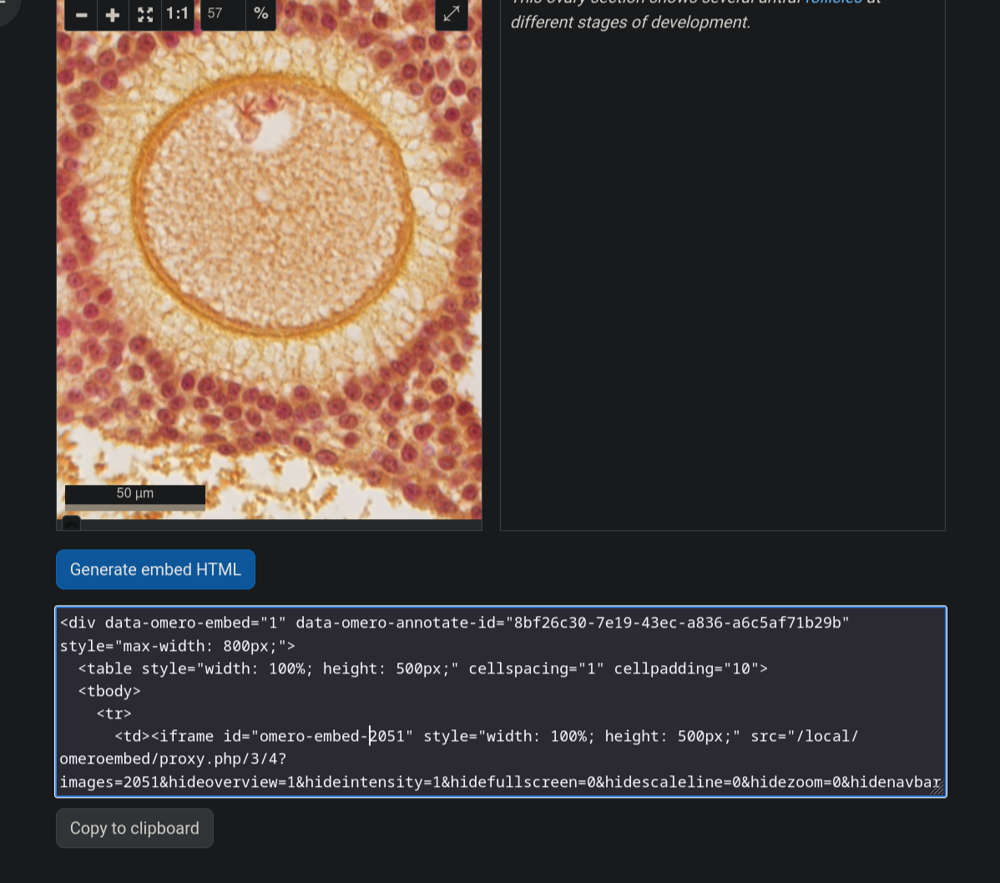

## A few things worth knowing

- **Students never need their own OMERO account.** Everything runs through
  a shared subject account behind the scenes, gated entirely by their
  normal Moodle enrolment.
- **You can come back and load a different slide any time** by revisiting
  the tool and filling in the form again - it doesn't remember or lock in
  your previous choice.
- **If the slide shows "Image not found"** immediately after loading, it's
  usually a temporary hiccup that resolves itself on a retry - if it
  persists, let whoever manages the plugin's settings know.

## Hotspot questions

A hotspot question asks a student to click directly on the slide to
answer - e.g. "Where is Meckel's cartilage?" - instead of choosing from a
written list. They find out right away whether they clicked in the right
place.

**To set one up**: choose the "Image with a short question below" layout
- hotspot questions only work with this layout. A new **Hotspot question**
dropdown appears: choose **Single region** (one correct spot) or
**Multiple regions** (any one of several correct spots counts - useful
when the same feature appears more than once on the slide). A small
drawing toolbar appears on the live preview - draw the correct region (or
regions) directly on the slide. This region is never sent to a student's
browser before they click - only whether their own click was right or
wrong.

Once a region is drawn, you can fine-tune it: drag the round white handle
above it to **rotate** it to match an angled feature, or drag any of the
4 square white corners to **resize** it - both stay centred on where you
originally drew it. For multiple regions, click a region first to select
it (needed for "Delete region" too) - the handles only ever show for
whichever one is currently selected.

Write your question in the text box below the slide, same as any other
layout.

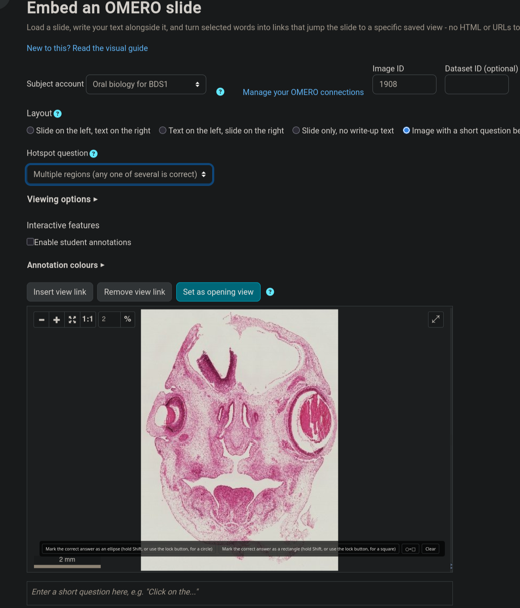

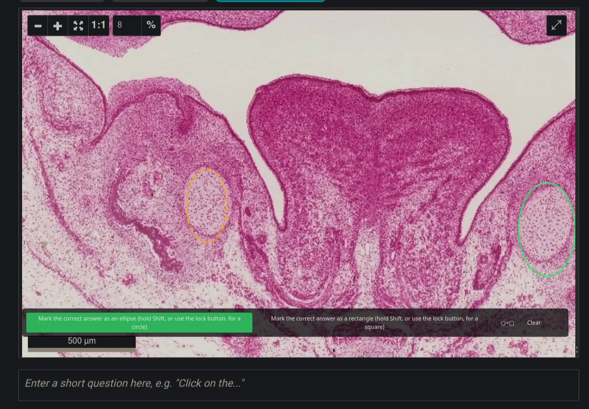

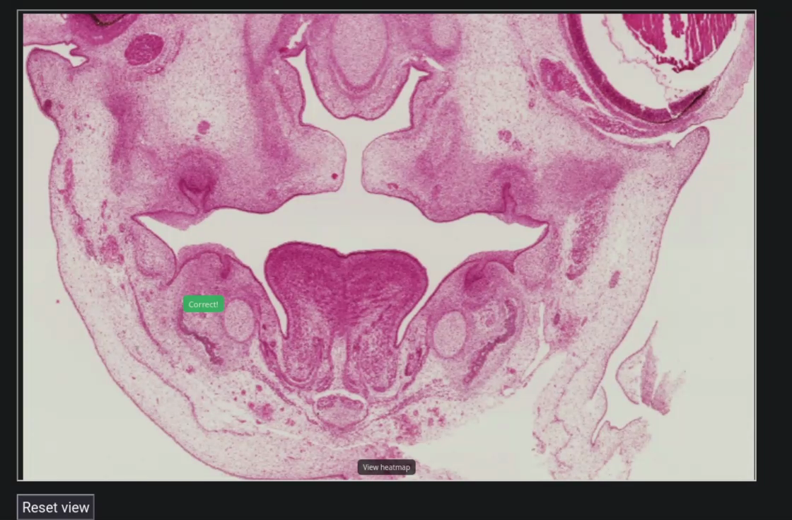

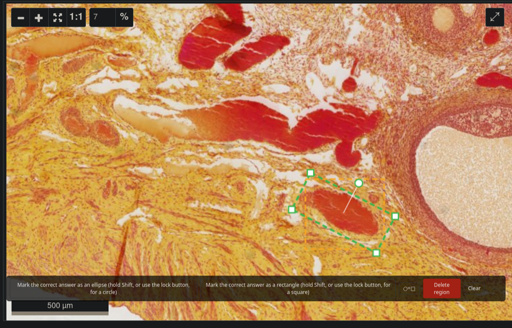

There's also a separate, fuller Moodle quiz question type
(`qtype_omerohotspot`/`qtype_omerohotspotmulti`) for graded hotspot
questions inside a real Moodle quiz - a different, deeper integration than
the standalone embed hotspot covered above. Ask whoever manages your
Moodle's plugins if you want graded quiz hotspots.
